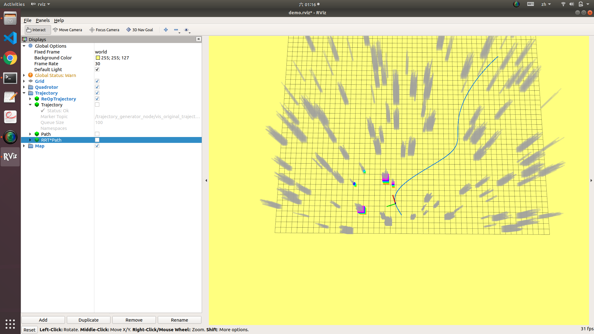

# Motion Planning For UAV
The final project of deepblue motion planning course. 
It's a C++ implementation of old-school motion planning pipeline (path finding + optimization). 
- [x] [RRT* algorithm](trajectory_generator/src/rtt_searcher.cpp) path finding based on OMPL library
- [x] [RDP algorithm](trajectory_generator/src/rtt_searcher.cpp) minimize waypoints based on divide & conquer
- [x] [Minimum-snap algorithm](trajectory_generator/src/trajectory_generator_waypoint.cpp) trajectory generation based on QP problem
- [x] [Trajectory replanning](trajectory_generator/src/trajectory_generator_node.cpp) trajectory replanning


## Compile & Run
```bash
#1 Install dependencies
sudo apt-get install cmake libopenblas-dev liblapack-dev libarpack-dev libarpack2-dev libsuperlu-dev

#2 Install Eigen and OMPL library

#3 Install aramadillo
xz -d armadillo-9.870.2.tar.xz
tar -xvf armadillo-9.870.2.tar
cd armadillo-9.870.2
mkdir build
cd build
cmake ..
make
sudo make install

#4 Compile and run basic program
cd ./catkin_ws
catkin build
roslaunch trajectory_generator demo.launch
```


## Motion Planning Result

